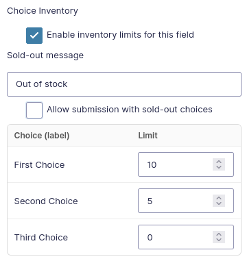

# Gravity Forms – Choice Inventory

Per-choice inventory limits for Gravity Forms choice fields (Radio/Checkbox/Select, including Image Choices).

- 🖊 **Field editor UI** with enable toggle, sold-out message, per-choice limit table (auto-syncs with choices)
- ✅ **Optional submissions** with sold-out choices
- 🏷 **Entry tagging** for sold-out picks (JSON + human summary)
- 📊 **Extra column** in Entries list
- 🔄 **Hidden field status** for conditional logic & notifications

## Installation

1. Upload the `gf-choice-inventory` folder to `/wp-content/plugins/`  
   or install the ZIP via **Plugins → Add New → Upload Plugin**.
2. Activate the plugin.
3. In the Form Editor, open a Radio/Checkbox/Select field and look for the **“Choice Inventory”** section.

---

## Usage

- Enable inventory for the field.
- Optionally set a custom **Sold-out message**.
- Optionally allow submissions with sold-out choices.
- Set per-choice limits:
  - **Blank** = unlimited
  - **≤ 0** = immediately sold-out
- Entries record any sold-out choices at submit time and display a summary in:
  - Entries list (extra column)
  - Entry detail view

---

## Hidden Field Status (Conditionals & Notifications)

This plugin can write a per-field **status** at submission time so you can use it in conditional logic, notifications, and workflows.

### How it works

1. Add a **Hidden** field (or a Text field you keep hidden).
2. In **Field Settings → Advanced → Parameter Name** (aka `inputName`), set: `gfci_{FIELD_ID}_status`

Where `{FIELD_ID}` is the numeric ID of the choice field that has inventory enabled.

### Possible values

- `available` — none of the selected choices for that field were sold-out at submit time.
- `soldout` — at least one selected choice was already sold-out at submit time (counts reflect state **before** saving the new entry).

### Example

If your ticket field has ID **7**, create a hidden field with: `gfci_7_status`

Then you can:

- Trigger **conditional logic** sections when the value is `soldout`
- Send special **admin notifications** for oversold picks

### Notes

- Works with **Radio**, **Checkbox**, and **Select** fields (including Image Choices)
- Unlimited choices always set status to `available`

---

## Requirements

- WordPress **6.0+**
- Gravity Forms **2.6+**
- PHP **7.4+**

---

## License

[MIT](https://github.com/refactorau/gf-choice-inventory/blob/main/LICENSE)

---

💡 **Pro tip:** Combine the hidden field with Gravity Flow or notification routing to flag oversold choices and alert admins in real time.